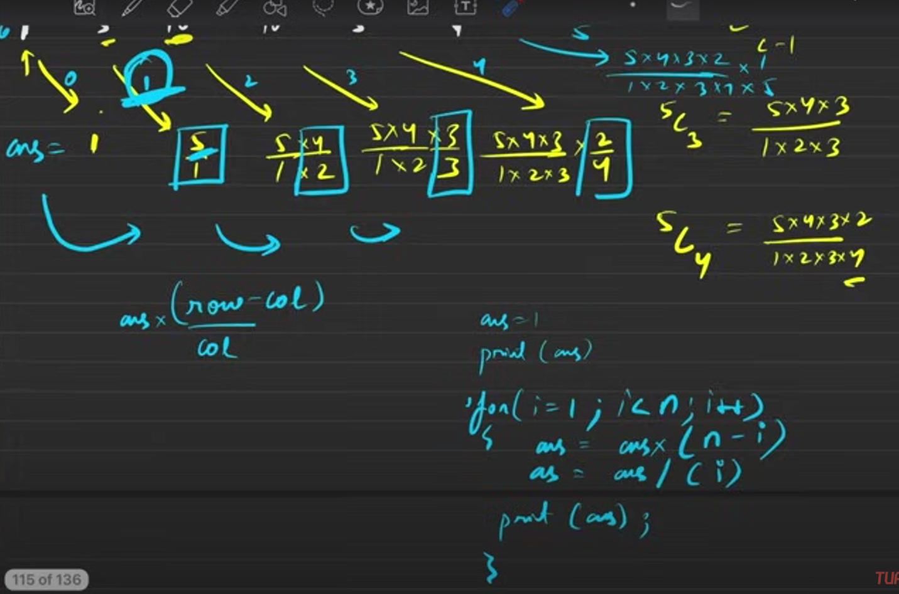
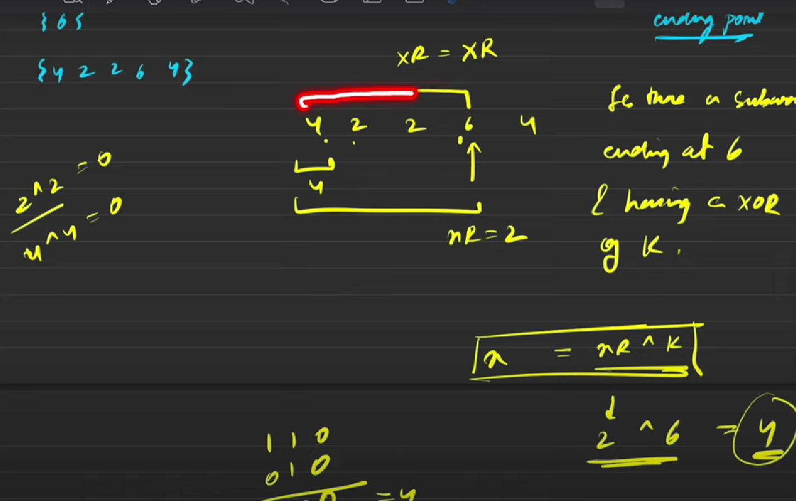
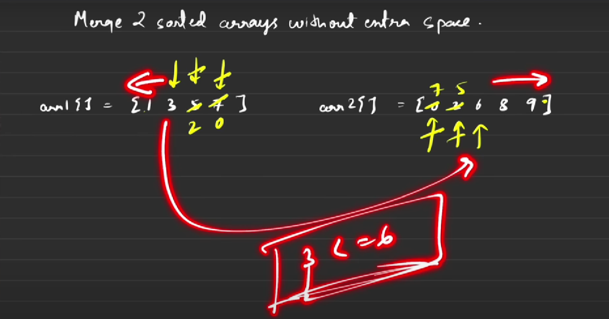
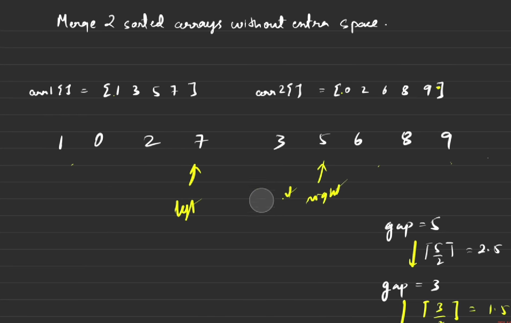
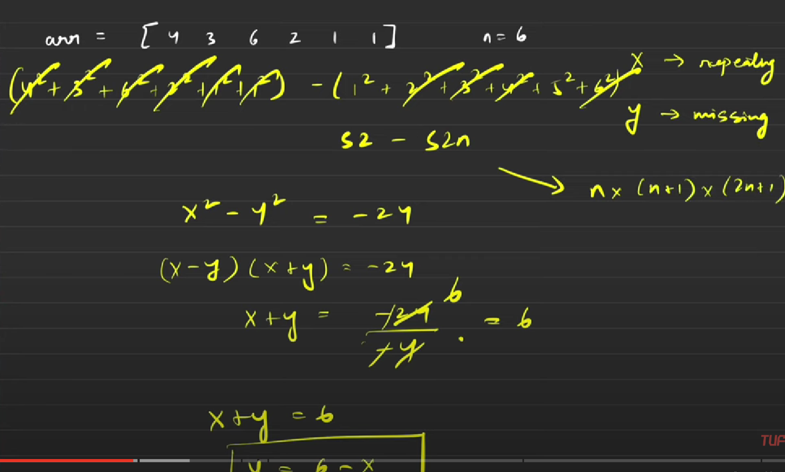
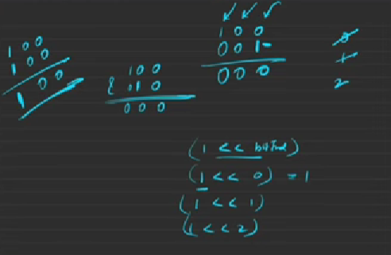
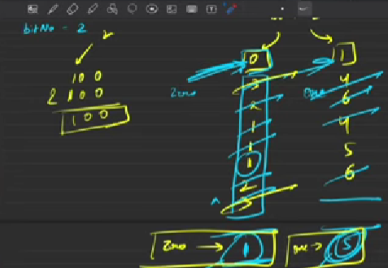

# Notes FOR DSA
### Pascal Triangle Q2 Video 34
THAT FORMULA GENERATION TECHNIQUE TO BE UNDERSTOOD

### Number of Subarrays with xor K Approach2
THis is the formula to calculate the first element of subarray see when we use to do this for subarrays of sum, that time what we did is to calculate the remainder then find it in subarray. Here also we did the same but the formaula to find the so called rem as refered to sum array , now in xor one we call it the first element and to caluculate that we have this formula in box. Now if this x(rem) exist in map then it is a subarray , otherwise it is not an subarray.

### Merge Sorted arrays without extra space Approach 1
What to do here is that we just need to put them in there own respective arrays but just in ascending order. So this is the method for First optimal approach where we compare the last element of first array to first element of second array, if the last element of first array is smaller than first element of second array then swap. Swap till it's possible then break. Then we will have our elements in their respective arrays but in unsorted manner we just need to sort them now.

### Merge Sorted arrays without extra space Approach 1
Maintain a gap variable like first time it would be n+m/2. Where n=size of array1, m=size of array2. Then for other iteration the gap is calculate by gap/=2 repeatedly and we do this till we complete 1 iteration when gap=1.

### FindMissingAndRepeatingNumberApproach3
We just solve this in mathematical way consider x and y as in picture. Now we will solve them by making equations. You will get 2 equations in X+Y and X-Y format and by solving them you get x and y. 

The eq1 you get is by subtraction of ((sum of numbers from 1 to n and)-(sum of elements of array)) you get x-y= something as value.

The eq2 you get is by the subtraction of ((sum of sqaures of numbers from 1 to n and)-(sum of squares of elements of array)). you get x^2-y^2= something as value. Which can be expanded as (x+y)(x-y)= some value. 

From which you would already have value of x-y from eq1 and by substituting you get value of x+y.
Now after solving x and y you will get values

### FindMissingAndRepeatingNumberApproach4
For how to find that bitNo. as we can see that we just move the bit from 1 to a specific position and do AND bcs the place where it becomes non-zero that is the first changeable bit of that number. No need to take tension for it going wrong bcs at every other places when we do AND it gives output 0.

