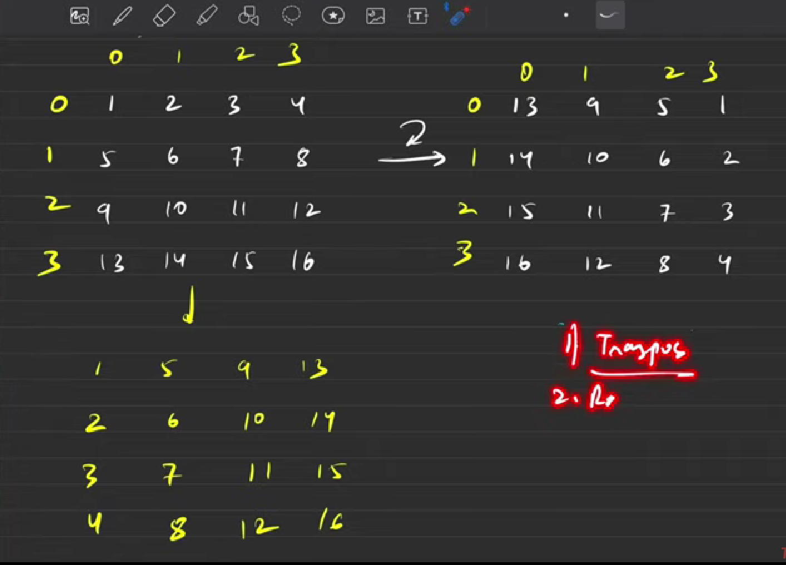
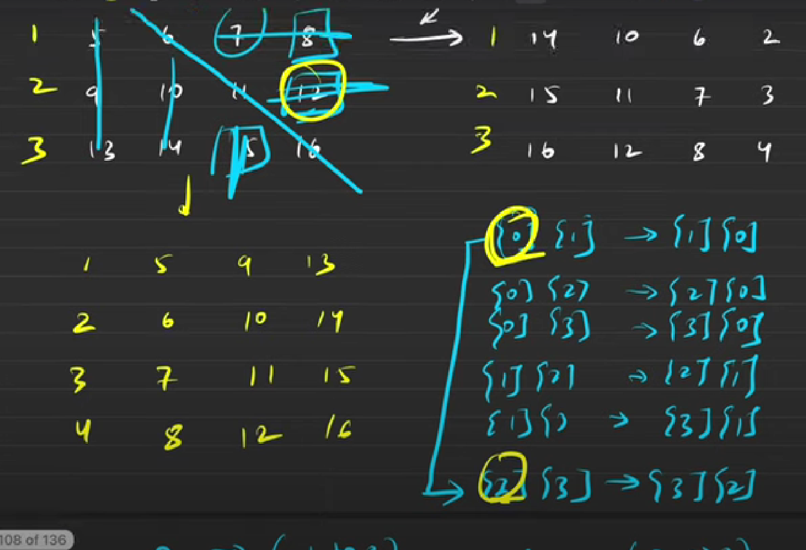
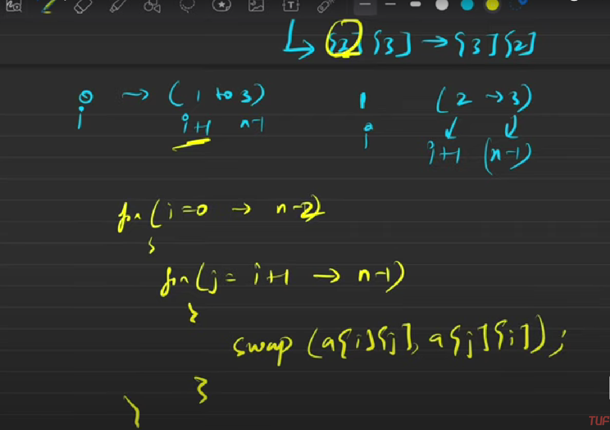
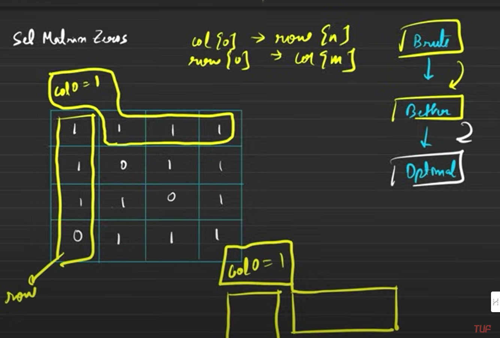

# NOTES FOR DSA
### RotateArray by 90 Degree


##### LOGIC FOR TRAVERSAL


## Zero Matrix
## Cntrl + Shift + V is key to view this.
FIRST ITERATE OVER REST ELEMENTS EXCEPT 0TH COL AND ROW BCS IF YOU CHANGE THEM THEN IT WILL CREATE PROBLEM.

NOW WHILE DOING OPERATION FOR 0TH COL AND ROW. FIRSTLY DO ON 0TH COL BCS ITS VALUE DEPENDS ON MATRIX[0][0].

THIS IS DONE AFTERWARDS BCS ITS VALUE DEPENDS ON VARIABLE COL0 WHICH IS NOT THE PART OF ARRAY AND WHICH MAKES THIS EXECUTION RUN PROPERLY.


```
void SetMatrixZeroes(vector<vector<int>> &matrix){
    //OPTIMAL APPROACH
    //SAME APPROACH AS ABOVE BUT HERE WE ARE CONIDERING FLAG ROW AND COL AS NOT SEPERATED BUT AS FIRST ROW AND COLUMN AS A FLAG ROW & COLUMN
    int m=matrix.size();
    int n=matrix[0].size();
    // int col[m]={0}   matrix [0][...]
    // int row[n]={0}   matrix [...][0]
    int col0=1;
    for(int i=0;i<m;i++){
        for(int j=0;j<n;j++){
            if(matrix[i][j]==0){
                matrix[i][0]=0;
                if (j!=0){
                    matrix[0][j]=0;
                }
                else{
                    col0=0;
                }
            }
        }
    }
    for (int i = 1; i < m; i++){
        for (int j = 1; j < n; j++){
            if(matrix[i][0]==0 || matrix[0][j]==0){
                matrix[i][j]=0;
            }
        }        
    }
    if(matrix[0][0]==0){
        for(int j=0;j<m;j++){
            matrix[0][j]=0;
        }
    }
    if(col0==0){
        for(int i=0;i<n;i++){
            matrix[i][0]=0;
        }
    }
    //T.C. - O(2*m*n)
    //S.C. - O(1)
}
```
